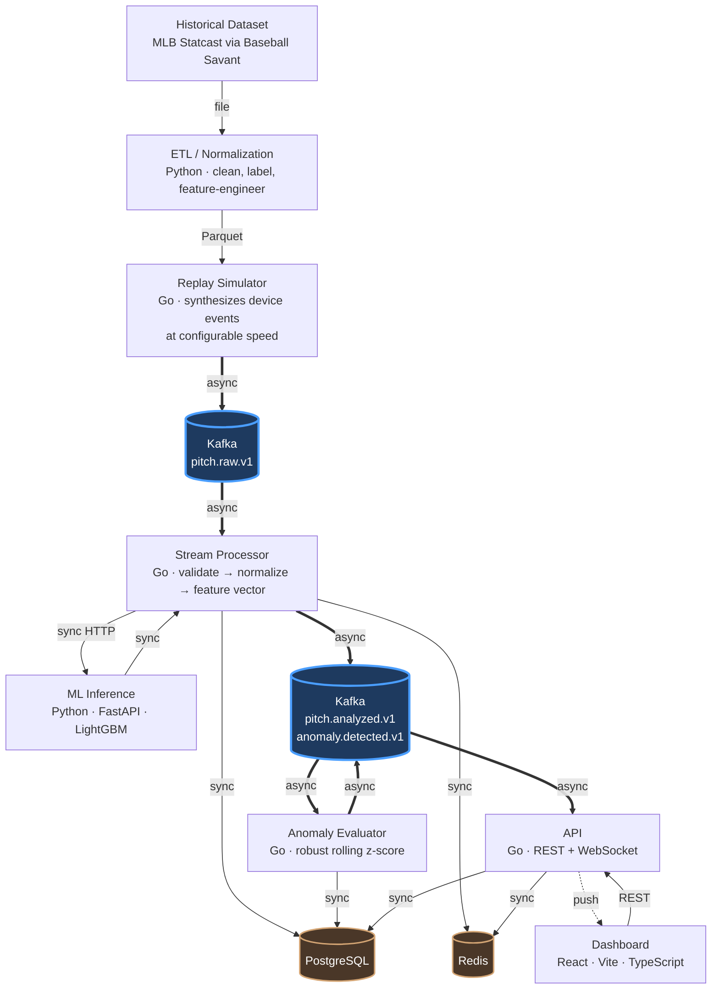

# PitchLab

**An event-driven pitch analytics platform that replays historical MLB Statcast data as a live tracking-device feed, scores every pitch with a calibrated ML model, and streams the results to a real-time dashboard.**

[](#roadmap)
[](https://go.dev)
[](https://python.org)
[](https://react.dev)

> **The goal is not to build the largest possible system.** It is to build a coherent, technically defensible, production-minded platform where every architectural decision — including the ones that were *rejected* — has a written justification.

---

## What problem does this solve?

A pitching coach watching a bullpen session wants to know three things, in real time:

1. **Was that a good pitch?** — not "was it 96 mph", but "given its velocity, spin, movement, release point and the count, how likely was it to produce a swing-and-miss?"
2. **How does it compare?** — to the league, and to this pitcher's own arsenal.
3. **Is something wrong?** — is the release point drifting, is velocity down, is this an early sign of fatigue?

Real tracking hardware (Hawk-Eye, TrackMan) is not available outside a stadium. So PitchLab **replays historical Statcast records as if they were arriving from a live device**, pushing them through a genuine event pipeline — Kafka → stream processor → ML inference → persistence → WebSocket → dashboard.

This makes it possible to build and demonstrate a real-time system without real-time hardware, while exercising every part of the production path.

---

## Architecture



**Thick blue arrows are asynchronous** (Kafka). Everything else is synchronous request/response, except the dashed WebSocket push.

The rule: a hop is synchronous when someone is *waiting for the answer*. The processor cannot persist a pitch without its prediction — so that call is synchronous. Nobody waits for the anomaly evaluator — so that hop is asynchronous.

---

## The ML problem

### It is not a made-up "pitch quality" score

The tempting approach is to invent a label — `0.4 × velocity + 0.3 × spin + 0.3 × movement` — and train a model on it. That is a tautology: the model just relearns the formula, and the weights are indefensible.

Instead, PitchLab predicts **something that actually happened**.

### Primary target: 5-class pitch outcome

For every competitive pitch, predict a calibrated probability distribution over:

| Class | Source |
|---|---|
| `BALL` | `description ∈ {ball, blocked_ball}` |
| `CALLED_STRIKE` | `description = called_strike` |
| `SWINGING_STRIKE` | `description ∈ {swinging_strike, swinging_strike_blocked}` |
| `FOUL` | `description ∈ {foul, foul_tip}` |
| `IN_PLAY` | `description = hit_into_play` |

This was chosen over four alternatives — whiff probability (covers only ~47% of pitches), called-strike probability (~53%, and being eroded by the 2026 ABS system), expected wOBA (**double leakage**: the target is derived from exit velocity and launch angle, *and* its mere presence reveals that contact occurred), and run-value regression (a spiky, discontinuous target dominated by base/out state rather than by the pitch).

The 5-class formulation covers **100% of pitches** and contains the other two targets as marginals.

### The presentation score is derived, not invented

```
xRV        = Σ  P(class) × RV[class, count_state]
PitchScore = 100 + 10 × ((μ − xRV) / σ)
```

- `RV[class, count]` is a 5×12 table of **empirical league averages** computed from the training split only
- `μ`, `σ` come from the training split and are frozen into the model artifact
- `100 / 10` is the industry convention used by public pitch-quality models (mean 100, SD 10, higher is better)

Every link in the chain comes from data. There is no hand-tuned weight anywhere, and the score is **reversible** — you can walk `PitchScore → xRV → class probabilities → feature contributions` and show your work in the UI.

### Two models, because one target does not answer both questions

The design called for a second "stuff" model: the same 5-class target, trained without location features, so that `stuff_score` would measure the pitch itself and `pitch_score − stuff_score` would isolate location's contribution.

Measurement killed that. Physical features reach only **0.554 AUC on the swing decision** — barely better than a coin flip. That is obvious in hindsight: a batter decides whether to offer based on where the pitch is going, not on its spin rate. Since the swing/take split dominates the 5-class target, a location-free model of it is close to useless (+1.3% over baseline).

Conditioning on a swing changes the picture — the same features reach **0.652 AUC**. So the stuff model was re-pointed at the question public Stuff+ models actually ask:

| Model | Target | Features | Answers |
|---|---|---|---|
| `pitching` | 5-class outcome, every pitch | physical + context + location | How good was this pitch, all in? |
| `stuff` | P(whiff \| swing), swings only | physical only | How hard is this pitch to hit when offered at? |

`location_score` was dropped for v1. The two models now predict different targets on different populations, so their scores are not on a common scale and subtracting them would manufacture a meaningless number. Location's contribution is still reported — `dist_from_zone_center` alone carries 58% of the outcome model's split gain — but turning that into a published score needs an ablation-based approach, deferred to the hardening phase.

---

## Leakage discipline

This dataset is unusually easy to leak, which is exactly why it is a good exercise. The defense is a **whitelist, not a blacklist**: a field does not enter the model unless it appears in a single `FEATURE_COLUMNS` constant, enforced by a unit test.

Two leaks are worth calling out because they are the ones that get missed:

**1. The missingness pattern.** `launch_speed` is only populated when the ball was hit. Handing the model that column — even full of nulls — hands it the label directly. Gradient boosters use missingness as a split criterion and will separate those classes perfectly. The model looks spectacular and is worthless.

Measured on a 28k-pitch sample, the column's fill rate by outcome class is:

| Class | `launch_speed` populated |
|---|---:|
| `IN_PLAY` | 99.6% |
| `FOUL` | 81.4% |
| `SWINGING_STRIKE` | 0.0% |
| `CALLED_STRIKE` | 0.0% |
| `BALL` | 0.0% |

The leak is wider than "it reveals `IN_PLAY`" — the field answers *did the bat touch the ball*, separating two classes from the other three.

**2. Future information.** `pitcher_days_since_prev_game` is safe. `pitcher_days_until_next_game` is not — that value cannot exist at pitch time, and a large one implies the pitcher got injured. One word apart; scientific validity apart.

One subtle distinction is preserved: `delta_run_exp` is **banned as a feature** (it is a function of the outcome by definition), but its **average per (class × count)** is a league constant — a lookup table, like a wOBA coefficient — and is used to convert probabilities into runs.

**Validation splits are temporal, never random.** Consecutive pitches within a plate appearance are dependent, and arsenal-relative features are pitcher-season aggregates; a random split leaks both.

```
├── train ─────────────┬── validation ──┬── test ────────┬── out-of-regime ──┤
│  2023 + 2024         │  2025 H1       │  2025 H2       │  2026             │
│  ~1.4M pitches       │  ~350K         │  ~350K         │  excluded         │
│  weights, RV table,  │  early stop,   │  read ONCE,    │  drift            │
│  μ/σ, arsenal refs   │  calibration   │  final report  │  demonstration    │
```

A sanity check is baked into the acceptance criteria: if any class reaches OvR AUC > 0.95, that is **an alarm, not a success**.

It fired. `BALL` came in at 0.950 and the outcome model beat its baseline by 33%, far outside the 8–15% band the design predicted. The investigation is in the results below; the short version is that the band was mis-specified, not the model.

## Results

Trained on the 2023–2025 snapshot (2.86M rows pulled, 1.42M after labelling and regime filtering). Test split read once, after the models were frozen.

| Model | Metric | Value | Baseline | |
|---|---|---:|---:|---|
| `pitching` | log loss | **0.9725** | 1.4578 | **+33.3%** |
| `pitching` | ECE | **0.0042** | — | well calibrated |
| `pitching` | accuracy | 58.95% | 36.47% | |
| `stuff` | ROC-AUC | **0.6532** | 0.5000 | |
| `stuff` | log loss | **0.5180** | 0.5442 | **+4.8%** |

Validation and test agree to within 0.05 percentage points (+33.34% vs +33.29%), which is the main evidence that the model is not overfit.

### Was the alarm leakage?

No — it was geometry, and three checks separate the two:

1. **Only geometric classes are affected.** `BALL` reaches 0.950; `CALLED_STRIKE` 0.897. Both are outcomes of pitches the batter *did not swing at*, where the result is by definition the pitch's position relative to the zone. The classes that require contact stay hard: `SWINGING_STRIKE` 0.766, `FOUL` 0.779, `IN_PLAY` 0.814. Leakage does not politely confine itself to three of five classes.
2. **The signal disappears without location.** Physical features alone reach 0.554 on the swing decision. A leaked outcome would show up there too.
3. **The dominant feature is a distance.** `dist_from_zone_center` carries 58% of split gain. That is a property of the ball's own trajectory, measured before the batter's decision resolves — not a property of what happened next.

The design's mistake was setting one expectation band for a target whose difficulty is wildly uneven across classes. The corrected framing: high discrimination on take outcomes is expected; on contact outcomes it would be suspicious.

---

## Why the training window is 2023–2025

Statcast column names are stable. Their **meanings are not.** Four regime breaks matter:

| Year | What changed | Consequence |
|---|---|---|
| **2020** | TrackMan radar → Hawk-Eye optical | Spin axis went from *inferred* to *directly measured* |
| **2021** (Jun 21) | Foreign-substance enforcement | League 4-seam spin dropped ~2318 → ~2231 RPM |
| **2023** | Pitch clock, shift ban, larger bases | Game-level behavior shifted |
| **2026** | **ABS challenge system** | `plate_x` / `plate_z` moved from **front-of-plate to middle-of-plate**; `sz_top` / `sz_bot` became ABS-defined (53.5% / 27% of player height) instead of operator-marked; the zone shrank |

The 2026 break is the dangerous one: **the column names did not change.** A model trained on 2025 and applied to 2026 raises no exception and throws no error — it just becomes quietly wrong.

This was asserted from MLB's field documentation during design, then verified against data. Comparing matched late-June weeks (28k pitches in 2025, 26k in 2026):

| Field | 2025 SD | 2026 SD | Cohen's *d* | |
|---|---:|---:|---:|---|
| `sz_top` | 0.192 | 0.101 | **−1.485** | regime-sensitive |
| `sz_bot` | 0.112 | 0.051 | +0.215 | regime-sensitive |
| `release_speed` | — | — | +0.037 | control |
| `release_spin_rate` | — | — | −0.039 | control |
| `release_extension` | — | — | +0.047 | control |
| `pfx_z` | — | — | −0.019 | control |

The clearest fingerprint is not the mean shift but the **cardinality collapse**: `sz_top` has **13,660 distinct values in 2025 and 243 in 2026**. Under the old system an operator marked the zone by hand on every pitch; under ABS it is derived deterministically from player height, so it collapses to roughly one value per player. Control fields move by |*d*| ≤ 0.05 across the same window, which rules out a generic season-to-season drift.

2026 is therefore excluded from training and evaluation — and repurposed as the **drift demonstration**.

Replaying 2026 against the 2023–2025 model and watching `ml_predicted_class_total` and `ml_feature_null_ratio` shift in Grafana is the concrete answer to "how would you notice your model degrading in production?" — and it is only possible because the data source is live rather than a frozen file.

---

## Secondary capability: performance anomaly detection

Per session, per pitch type, track the pitcher's own physical baseline — release speed, spin rate, release position, extension, movement — using a **robust rolling z-score**:

```
σ̂ = 1.4826 × MAD(window)
z  = (observed − median(window)) / σ̂          window = last 10 outings
```

Median and MAD are used instead of mean and standard deviation because a single injury outing would otherwise inflate the window's `σ` and mask every subsequent real anomaly.

Isolation Forest was evaluated and rejected: it is not explainable (the consumer of this output is a coach, not a data scientist), it needs per-pitcher training data so it cold-starts badly, and its `contamination` parameter is exactly the kind of arbitrary hand-tuned constant this project avoids elsewhere.

Output is directly actionable: *"Fastball velocity is 1.8 mph below the median of your last 10 outings (robust z = −3.4)."*

---

## Engineering decisions worth defending

<details>
<summary><strong>Three long-lived processes, not eight microservices</strong></summary>

`cmd/api` and `cmd/processor` are **two binaries from one Go codebase** — a modular monolith. They share the domain model, repository layer and validation rules; splitting the code would mean keeping two copies of the same `Pitch` struct in sync for no benefit.

They are split at *runtime* because their scaling profiles genuinely differ: the API is latency-bound and driven by unpredictable user traffic; the processor is throughput-bound and driven by Kafka lag. When a 50× replay saturates the processor, the WebSocket hub must not slow down with it.

`pitchlab-ml` **is** a separate service, and passes the test the others fail: different runtime (LightGBM + SHAP is a Python ecosystem), different release cadence (models retrain weekly, backends ship monthly), different scaling shape (stateless CPU-bound inference). It holds no database connection.

Rejected as artificial: separate Athlete / Session / Pitch services (same transactional boundary), an Analytics service (a second process against the same PostgreSQL is an HTTP proxy, not a microservice — analytics lives in `internal/analytics`), an event-routing service, and an API gateway with nothing behind it.
</details>

<details>
<summary><strong>Three Kafka topics, not five</strong></summary>

`pitch.raw.v1` → `pitch.analyzed.v1` → `anomaly.detected.v1`, plus two DLQs.

`pitch.normalized` was rejected because **it has no independent consumer** — the only thing that would read it is the prediction step, in the same process, in the same processing step. Splitting a self-continuing pipeline stage into a topic buys distributed-systems complexity for nothing: an extra serialization, an extra broker round-trip, an extra DLQ, an extra lag metric.

`prediction.generated` was rejected because a prediction is a *property* of a pitch, not a separate event. Splitting it would force consumers into a distributed join and make the dashboard render twice.

The rule: **an event earns a topic when it has at least one independent consumer.**
</details>

<details>
<summary><strong>At-least-once delivery with an idempotent consumer</strong></summary>

Kafka does not deliver exactly once to external systems. The correct answer is to make the consumer idempotent rather than to ask the broker for stronger promises.

```
external_pitch_uid = "<game>:<at_bat>:<pitch>"      -- deterministic natural key
UNIQUE (external_pitch_uid)                          -- enforced in PostgreSQL
INSERT ... ON CONFLICT (external_pitch_uid) DO NOTHING RETURNING id
```

An application-level `SELECT`-then-`INSERT` is open to a race between two processor instances. The database constraint is atomic regardless of concurrency — correctness is enforced at the lowest layer that can enforce it.

Offsets are committed **after** the work completes. The alternative would be at-most-once, which loses pitches.
</details>

<details>
<summary><strong>In-consumer retry, accepting head-of-line blocking</strong></summary>

Retries happen in-process with exponential backoff and jitter (5 attempts, ~3.1s ceiling). Retry topics were rejected because they **break ordering** — pitch 2 lands in a delay topic while pitch 3 flows through normally, and within-session order is a hard requirement.

Permanent errors (schema, validation) are never retried. Retrying malformed JSON five times fails five times and blocks the partition five times longer; a schema error does not heal with time. Those go straight to the DLQ.

The accepted cost — up to ~3.1s of partition delay in the worst case — is visible in `kafka_consumer_lag`.
</details>

<details>
<summary><strong>Redis is genuinely optional</strong></summary>

Three uses were accepted: live session counters (per-pitch writes would cause row-lock contention and MVCC bloat in PostgreSQL — `HINCRBY` is built for this), athlete analytics caching (with the schema version *in the key*, so a deploy invalidates stale entries automatically), and WebSocket fan-out via Pub/Sub (Kafka consumer groups are work-sharing, not broadcast).

Five were rejected, including caching individual pitch rows — a primary-key lookup takes under a millisecond and PostgreSQL already buffers it; adding Redis there buys a network hop and nothing else.

Every Redis call has a **50ms timeout** and falls back to PostgreSQL on any error. `/readyz` reports Redis as `degraded` but still returns `200`. The phase gate is explicit: **`docker compose stop redis` must leave every endpoint working.**
</details>

<details>
<summary><strong>The replay simulator cannot write to the database</strong></summary>

Enforced at compile time — `cmd/replay` does not import the PostgreSQL or Redis drivers.

A real Hawk-Eye camera does not write to your database; it emits events. If the simulator wrote directly, the Kafka → processor → ML → PostgreSQL backbone would never execute during a demo, and normalization plus idempotency logic would exist in two copies that inevitably diverge.

There is a second benefit: because a device cannot know the outcome of a pitch, the simulator cannot emit `launch_speed` or `delta_run_exp` either. **Faithfully imitating the device structurally reinforces the leakage defense.** Ground truth travels in a separate envelope section and is written only to `pitches.actual_outcome`, never into a feature vector.
</details>

<details>
<summary><strong>A lock-free WebSocket hub with typed backpressure</strong></summary>

One hub goroutine owns the client registry — no mutex, so no lock-ordering bug is possible. Each connection gets a reader and a writer goroutine, because the WebSocket protocol permits exactly one of each.

Each client has a **bounded** 256-message channel. Unbounded buffering means ten slow clients can exhaust server memory; bounded buffering means the system degrades predictably. The drop policy is per message type:

| Type | Policy | Why |
|---|---|---|
| `session.metrics` | drop oldest | Cumulative — the stale value is worthless |
| `pitch.analyzed` | drop newest + count | Independent events; the client detects the `seq` gap and backfills over REST |
| `anomaly.detected` | never dropped | Low volume, high value |

The hub writes non-blocking, so one slow client never stalls the broadcast.
</details>

---

## The schema, and what the tests proved about it

Eight tables. The two entities that are *absent* matter as much as the ones present: `Pitcher` and `Batter` are roles expressed through foreign keys on `pitches`, not separate tables, because the same person can do both and MLBAM itself uses one player id. `Game` and `PlateAppearance` would add a join layer without enabling a single query.

Correctness lives in the database rather than in application code, because that is the only layer that can enforce it under concurrency:

- **Idempotency** is a unique constraint on `external_pitch_uid` plus `ON CONFLICT DO NOTHING`. Kafka delivers at least once, so a redelivered pitch is routine, not exceptional. A select-then-insert would race between processor instances; a constraint does not.
- **The rulebook** is CHECK constraints. `balls BETWEEN 0 AND 3`, `release_speed BETWEEN 40 AND 110`. A device reporting five balls is reporting a fault, and it is stopped at write time rather than found later in a training set.
- **One active model per variant** is a partial unique index on `(variant) WHERE is_active`, not an application-level deactivate-then-activate, which two concurrent deployments could interleave.

Three of these were rewritten because a test disproved the original design:

**A redundant unique constraint broke the thing it was meant to protect.** `(session_id, at_bat_number, pitch_number)` was added as a second line of defence. But `ON CONFLICT` names a single arbiter index, so a redelivered pitch — which collides on *both* constraints — resolved cleanly against the uid and then raised a hard error on the other one when two consumers raced. A 16-goroutine concurrency test surfaced it. The constraint was also nearly redundant, since an at-bat has exactly one pitcher. It was removed.

**A data-modifying CTE cannot express "then".** Model activation was written as one statement: a CTE deactivating the incumbent, then an UPDATE activating the successor. PostgreSQL runs every CTE against the same snapshot, so the deactivation was invisible to the activation and the partial unique index rejected the write. It is now two statements in one transaction — and the index still makes two concurrent activations impossible rather than merely unlikely.

**An index nothing used was deleted.** A catalogue-level test resets `pg_stat`, runs every real access pattern, and reports any index the planner never touched. `ix_meas_speed` never registered a scan: velocity filters drive off the pitcher index and then join measurements by primary key. An index no query uses costs every write and returns nothing, so it went.

The remaining twelve indexes each have a test that makes the planner name it in an `EXPLAIN (ANALYZE)` plan. Getting those tests to mean anything required fixing the fixture twice — with two pitchers, one pitcher is half the table and a sequential scan is genuinely the better plan, so the test was measuring the fixture rather than the schema.

---

## The API

`/api/v1`, served by Go's own `net/http` mux — since 1.22 it routes on method and path patterns, so a third-party router would be a dependency taken on for syntax.

A few decisions are worth stating because they are the ones a reviewer would push on.

**`GET /pitches` requires `pitcher_id`.** Without it the query is a sequential scan over millions of rows. Refusing to express the expensive query is cheaper than finding it in production and optimizing afterwards — the endpoint returns 400 and names the missing filter.

**Pagination is keyset, and the cursor always carries an id.** Offsets shift under a table that is appended to continuously, so pages repeat or skip rows. The id tiebreaker is not decoration: replay can emit several pitches with the same timestamp, and paginating on time alone silently drops all but one at a page boundary. `HasMore` comes from fetching one row past the limit, because a `COUNT` over this table would cost as much as the page.

**`POST /sessions/{id}/close` is an action, not a `PATCH`.** It is a state transition with side effects — it triggers anomaly evaluation and lets live session state expire. `PATCH {"status": "COMPLETED"}` would disguise that as a field update. Calling it twice returns 409, not a silent success and not a 404: "already done" and "never existed" are different answers.

**Empty aggregates are null, not zero.** SQL returns 0 for `avg()` over no rows. Reporting that as a measurement would claim a pitcher throws 0 mph. The response omits the value and the client can say so.

**`/healthz` checks nothing.** If liveness probed the database, one slow query would mark every instance unhealthy, the orchestrator would restart them together, and a blip would become an outage. `/readyz` does the dependency checking — and reports Redis as `degraded` while still returning 200, because a cache outage must not take the API out of rotation.

**Every error is an RFC 7807 problem document carrying a request id**, so a user report maps to a log line. Internal error text never reaches the client; it goes to the logs under the same id.

Request id and correlation id are deliberately separate headers. One covers a single HTTP request; the other follows one pitch across every service and topic, from the replay simulator to the browser console.

---

## The inference service

The one genuinely separate service in the system, and it passes the test the others fail: a different runtime (LightGBM and SHAP are a Python ecosystem), a different release cadence (models retrain on their own schedule), and a different scaling shape (stateless, CPU-bound). It holds no database connection and knows no domain rules — given a feature vector it returns a number.

**Training and serving are checked against each other.** A test scores the same pitches through the service and through the offline training code and requires the probabilities to match to 1e-12. Divergence there is the classic way a model goes quietly wrong in production: nothing errors, the numbers just stop meaning anything. They currently match to zero.

**Unknown features are rejected, not ignored.** Send `realease_speed` and the request fails with a 400 naming the field. Ignoring it would turn a typo into a missing value, and the pitch would be scored on incomplete input with nothing anywhere reporting a problem. Missing features *are* allowed — a device can fail to read a value, and the model handles that natively; imputing a mean would invent a measurement nobody took.

**Model artifacts are validated at startup.** The booster carries its own feature names; if they disagree with the model card, the process refuses to start rather than scoring every pitch on the wrong columns.

**SHAP is off the live path, and the measurement says why.** Measured on this hardware:

| Batch | p50 | p95 | Per pitch |
|---:|---:|---:|---:|
| 1 | 4.55 ms | 5.35 ms | 4.55 ms |
| 10 | 5.26 ms | 5.88 ms | 0.53 ms |
| 50 | 7.18 ms | 7.74 ms | 0.14 ms |
| 200 | 15.93 ms | 17.11 ms | 0.08 ms |
| **1, with SHAP** | **49.94 ms** | **52.66 ms** | — |

An explanation costs eleven times a prediction. The stream needs the number; a user opening one pitch can afford to wait.

**Explanations are reported in margin space, not probability.** SHAP is additive in log-odds — base value plus contributions equals the prediction exactly. Softmax is not linear, so that guarantee does not survive conversion, and presenting the values as "probability points" would be a convenient lie. The response carries the probability separately, plus `other_contribution` for everything outside the top N, so the decomposition still adds up and truncation is distinguishable from a bug.

### When inference is down

The processor calls the service synchronously, because it cannot persist a pitch without the prediction that goes to the dashboard with it. Putting a topic between them would be asynchrony for its own sake — one side would still be waiting, just with more moving parts.

What must not happen is the pipeline stopping. A circuit breaker trips after five consecutive failures and then fails immediately rather than letting every message pay its full retry budget to rediscover the same outage; it probes after thirty seconds and needs two consecutive successes to close, because one could be luck. A failure while probing reopens at once — the probe *was* the test.

The pitch is persisted either way, marked as having no prediction, and can be backfilled from data already in PostgreSQL. A contract violation is surfaced as its own error type and never retried: training and serving disagreeing about what a feature vector looks like is not something waiting fixes.

---

## The event pipeline

Three work topics and two dead-letter queues. Auto-creation is disabled on the broker, because a topic created on demand gets the broker default of one partition — which silently removes the only thing guaranteeing that a session's pitches are processed in order. Failing on a missing topic beats succeeding with a broken guarantee.

One envelope wraps every message, carrying the four things the architecture's guarantees rest on: a correlation id that follows one pitch across every service, a causation id saying which event produced which, a deterministic idempotency key, and a schema version. `occurred_at` and `produced_at` are separate fields — under replay they differ by years, and keeping them apart is what stops a 2025 pitch from being mistaken for something that just happened.

**Delivery is at-least-once and the consumer absorbs it.** Offsets are committed after the work, never before; `FetchMessage` with manual commit rather than `ReadMessage`, which commits for you. A redelivered pitch is recognised by its natural key and skipped. Three deliveries of the same pitch produce one row.

**Errors are classified before they are handled.** Transient failures retry with exponential backoff and jitter — the jitter matters, because when a shared dependency fails every partition's message fails at once and would otherwise retry in lockstep. Permanent failures are never retried: malformed JSON fails identically five times and blocks the partition five times longer. The default is transient, deliberately, since wrongly retrying costs seconds while wrongly discarding loses a pitch.

Retry topics were rejected. They break ordering: pitch 2 lands in a delay topic while pitch 3 flows through normally. In-consumer retry accepts up to ~3s of head-of-line blocking to keep the guarantee.

### Two bugs the tests found

**The dead-letter queue silently dropped malformed messages.** The record embedded the original bytes as a `json.RawMessage`, so encoding it failed whenever the original was not valid JSON — and the queue lost exactly the messages it exists to capture. A test publishing `{"this is not: ` found it. The original bytes are now stored base64-encoded, with a decoded copy attached only when it would not break the encoding.

**kafka-go's package-level transport caches topic metadata process-wide**, so a writer can be told a topic does not exist because a *different* writer looked before it was created. Integration tests passed individually and failed as a suite. Each producer now owns its transport with a one-second metadata TTL — the same staleness would have delayed writes to newly created topics in production.

### Training and serving cannot drift apart

The Go processor and the Python training code both transform raw readings, and they have to agree exactly. If they drift nothing errors — the model just starts receiving features that mean something slightly different from what it was trained on.

A golden fixture pins them together: real pitches are run through the training-time feature code, and a Go test requires a match to 1e-9. The fixture covers all four handedness combinations, because a fixture of only right-on-right pitches would pass with the mirroring inverted — which is how that bug shipped the first time. Inverting the mirroring deliberately produces 69 mismatches, so the test is not passing vacuously.

The leakage defense on the Go side is the shape of a struct: `FeatureInput` has no field for the outcome, so the feature builder cannot be handed one. `pitches.actual_outcome` exists and is written; it simply cannot reach the model.

---

## The replay simulator

Real tracking hardware is not available outside a stadium, so the simulator stands in for it — and the value is in *how faithfully* it stands in.

**It publishes to Kafka and nothing else.** The binary does not import the database, the cache, or the inference client, and a test enforces that by inspecting the dependency graph (`go list -deps`). This is not tidiness. If the simulator wrote to PostgreSQL directly, the Kafka → processor → inference → storage backbone would never execute during a demo, and normalization and idempotency would exist in two copies that inevitably drift.

**It emits raw readings.** Handedness mirroring, circular spin encoding, and zone normalization are domain rules that belong in the processor, where they are pinned to the training code by the golden fixture. A camera does not know which hand threw the pitch.

**It cannot emit an outcome.** The event has nowhere to put exit velocity or run value, because the device that produces it could not measure them. Imitating the device faithfully is what turns the leakage defense from a matter of remembering into a structural property: a field that cannot be transmitted cannot accidentally reach a feature vector.

### Synthetic time

Statcast records a calendar date, not a clock, so a replayed pitch has no timestamp to reuse — the simulator synthesizes one from game state, which is what actually governs pace: 19s with the bases empty, 23s with a runner on (the 2023 pitch timer plus the pitcher's routine), +2s at two strikes, +25s for a new batter, +150s for a change of sides, and −2s…+4s of jitter so the stream reads like a game rather than a metronome.

The clock is seeded, and the seed is mixed with the session key rather than used globally — so adding or removing an outing does not shift the timestamps of the others. The same tape and seed replay identically, which is what makes a demo rehearsable and a timing test able to assert anything at all.

`occurred_at` (synthetic, in 2025) and `produced_at` (now) stay separate fields, so nothing downstream mistakes a replayed pitch for something that just happened.

### The bug this phase found

The first end-to-end run produced 344 predictions from the outcome model and **zero** from the stuff model. The processor was attaching `pitch_number` to every variant, but the stuff variant is trained on pitch shape alone — sequence and rest are *situation*, not shape. The inference service rejected all 344 calls with `unknown feature(s) for variant stuff: pitch_number`.

That is exactly what the feature-contract check exists for. Without it the field would have been silently ignored and a `stuff_score` produced from an input the model never saw in training, with nothing failing anywhere.

### Measured end to end

3 outings, 344 pitches, requested 800×: **19.6 seconds wall clock, 612× effective**, 344 pitches and 344 measurements persisted, 688 predictions across both variants, 344/344 at `prediction_status='OK'`, zero processor warnings.

(The effective-speed figure was initially reported as 109,152×. The span was being taken as overall min-to-max across outings from *different calendar dates*, so it counted the days between games. It is now summed per outing.)

---

## The real-time channel

`GET /ws/sessions/{sessionId}` — one channel per outing, read-only, and lock-free.

### The registry is owned by one goroutine

No mutex, anywhere. A single goroutine owns `map[sessionID]map[*Client]struct{}` and nothing else ever touches it, so there is no lock to forget and no lock ordering to get wrong. The alternative — an `RWMutex` — works, but the read lock is held for the length of a broadcast, so registering a client waits behind the slowest send in the loop.

Each connection gets exactly one reader and one writer goroutine. That is not a style preference: a WebSocket supports neither concurrent reads nor concurrent writes, and the penalty for getting it wrong is a panic inside the library.

### Sequence numbers are assigned on enqueue, not on write

This is the part worth defending. A message dropped because the client is too slow has **already consumed its sequence number**, so the client sees a gap and knows to reconcile over REST. It is the WebSocket equivalent of a Kafka offset: not a guarantee of delivery, but a guarantee that non-delivery is *detectable*.

Each client's queue is bounded at 256, with a policy per message type:

| Type | Policy | Why |
|---|---|---|
| `pitch.analyzed` | drop, count it | Independent events; order matters and the gap must be visible |
| `session.metrics` | drop | Cumulative; a fresher one arrives within a second |
| `anomaly.detected` | **never dropped** — close with 1013 instead | Rare and high-value; silently discarding one defeats the point of detecting it |
| `session.closed` | never dropped | Terminal message |

An unbounded queue would let one slow client consume server memory until the process died — ten of them and the answer is an OOM kill. A bounded queue with an explicit drop policy degrades predictably instead: the slow client loses its own data, and nobody else notices. A test proves exactly that, with a stalled client and a healthy one on the same session.

The close code is `1013 Try Again Later`, not `1011 Internal Error`. Nothing is broken; the server is shedding a client it cannot keep up with, and the code tells that client reconnecting is the right response.

### Origin is checked even though there is no authentication

v1 has no authentication — a deliberate scope decision. That is not a reason to skip the one control that needs none. WebSocket is *not* subject to the same-origin policy, so a server that does not check `Origin` lets any page on the internet open a connection on a visitor's behalf. The allowlist is read from configuration, rejects `*` at startup, and is applied **before** the upgrade: a refusal should cost an HTTP response, not a socket, two goroutines and a 256-slot buffer. A test asserts that a rejected origin does not even reach the snapshot query.

### The bug the live run found

Every upgrade returned **500**, with a 22-byte body: `Internal Server Error\n`.

The access-log middleware wraps the response writer to record the status code. A WebSocket upgrade works by hijacking the connection, and the upgrade library type-asserts `http.Hijacker` **directly** rather than going through `http.ResponseController` — so it saw a wrapper that could not be hijacked and failed every handshake. The `Unwrap` method that had been sitting there since phase 3, with a comment claiming it was what the WebSocket upgrade needed, was simply wrong.

No unit test in the WebSocket package could have caught it: those tests mount the handler without the middleware chain. What caught it was running the thing end to end. The regression test now hijacks through the full chain, and inverting the fix turns it red.

### Measured end to end

```
replay → Kafka → processor → ML → PostgreSQL → Kafka → API fan-out → WebSocket → client
```

```
   0  session.snapshot  last_pitch_index=16
   1  pitch.analyzed    #17   FF   97.6 mph  BALL             pitching=91.7  stuff=101.7
   2  session.metrics   {"pitch_count":17,...}
   3  pitch.analyzed    #18   SL   87.5 mph  SWINGING_STRIKE  pitching=90.4  stuff=104.6
   4  pitch.analyzed    #19   SL   86.9 mph  FOUL             pitching=105.6 stuff=105.1
```

The snapshot reports `last_pitch_index=16` and the first live pitch is `#17` — no gap. That is precisely what `last_pitch_index` exists to make visible: between the REST read and the moment the connection registers, a pitch can arrive and vanish, and the client has to be able to tell.

Rollups are throttled to one per second. At 800× replay a pitch arrives every few milliseconds, and sending a metrics update with each one would force the browser to re-render hundreds of times a second to display numbers a human cannot read that fast.

### One consumer group per instance

The fan-out consumer uses `ws-fanout-<instance>` rather than a single shared group. A shared group splits partitions between replicas, so a browser connected to the replica that was *not* assigned its session's partition receives nothing — with no error anywhere, because as far as Kafka is concerned the messages were delivered. Each replica reading the whole topic costs bandwidth and gets the semantics right. Phase 8 replaces it with a single consumer fanning out over Redis.

The consumer starts at the latest offset, has no dead-letter queue, and never returns an error. It owns no durable state: the pitch is already committed to PostgreSQL, so a broadcast that cannot be built costs a live update and nothing more. Retrying and then dead-lettering it would stall a partition over a cosmetic problem.

---

## The cache, and the proof it is not load-bearing

Redis earns its place in exactly two ways here, and a third use the design had accepted was rejected once phase 7 made it redundant.

### It is optional in the type system

A `nil` cache is a valid cache that always misses, and every method tolerates being called on one. No handler has an "if the cache is configured" branch. No method returns an error for a Redis failure: a read that fails is a miss, a write that fails is logged and forgotten, and the caller carries on against PostgreSQL. **There is no code path by which a Redis problem becomes a failed request** — not by convention, but because there is nowhere to put one.

Both processes also start with Redis down. Refusing to boot over a cache is how a cache becomes critical.

### Live session counters

`sessions.pitch_count` and its averages are only recomputed when an outing *ends*. During live play the row reads zero — which is the gap these counters fill.

They change once per pitch, and in burst replay that is hundreds of writes a second to one logical row. In PostgreSQL that means hundreds of `UPDATE`s against a single row: lock contention, a new row version each time, and a table that needs vacuuming to stay usable. `HINCRBY` is atomic, lock-free and O(1).

Losing them costs nothing, and that is the other half of the argument: a single query rebuilds every value from the rows themselves. When an outing ends, the authoritative aggregates are written to PostgreSQL and *then* the key is dropped — in that order, so a failed recompute cannot leave both copies gone.

**The hazard worth naming:** these counters are incremented, not recomputed, so at-least-once delivery is a real risk for them in a way it is not for the database. The natural key absorbs a duplicate row; nothing absorbs a duplicate `HINCRBY`. The protection is ordering — the duplicate check returns *before* the cache is touched. A test publishes the same pitch three times and asserts one row **and** a live count of one.

### Cached analytics, and why the design's invalidation was wrong

The athlete rollup runs up to four aggregates over every pitch a pitcher has thrown. The design said to cache it under one key per athlete and delete that key when a new pitch arrives.

That is correct only while the endpoint has one shape. It has several: `from`, `to` and `include` all change the payload, so one athlete has **several valid entries at once**. Deleting one key would invalidate one and leave the rest stale — while looking exactly like invalidation had worked.

The fix is a generation counter. The processor does one `INCR`; the key embeds the generation, so every variant becomes unaddressable at once, with no keyspace scan for keys to delete. Old entries are not removed — they become unreachable and expire.

The key also carries a schema version, so a deploy that changes the cached shape misses every pre-deploy entry instead of decoding it. No cache flush, and no ordering requirement between the deploy and the cache.

Invalidating rather than updating is deliberate too: updating in place would require the stream processor to know how the API computes its rollups — the same logic in two services, wrong the first time either one changes.

### What was rejected

Redis Pub/Sub for WebSocket fan-out was in the design and is **not implemented**. Phase 7 solved the same problem by giving each replica its own Kafka consumer group, so every replica already receives every message; Pub/Sub would be a second mechanism for a guarantee that already holds. The trade-off is stated rather than hidden: each replica reads the whole topic, which costs bandwidth. At this scale that is cheaper than another component in the broadcast path.

Adding it anyway would be precisely the mistake the design warns about — using Redis because it is in the stack. Applied honestly, the criterion says no.

Also rejected: caching individual pitches (a primary-key lookup PostgreSQL answers in under a millisecond from its own buffer cache), caching predictions (immutable and already stored — a second copy buys nothing and risks disagreement), and caching session lists (an index already covers it; measure first).

### Measured

| | Latency | `X-Cache` |
|---|---|---|
| Cold — computed | 4.9 ms | `MISS` |
| Warm — cached | ~1.05 ms | `HIT` |
| **Redis stopped** | 2.0–9.9 ms | `MISS`, every response **200** |

With `docker compose stop redis`, all thirteen REST endpoints answer `200`, `/readyz` returns `200` with `degraded: ["redis"]` rather than taking the instance out of rotation, and the WebSocket snapshot rebuilds its metrics from the rows — matching the PostgreSQL values exactly (`121 | 86.529755 | 2375.4712 | 99.141304`).

Calls are bounded at 50 ms with retries disabled. The library's default of three attempts with backoff would stack three dial timeouts inside one request against an unreachable Redis. The dangerous failure is not a refused connection — that returns immediately — but a server that accepts and never answers; a test stands one up and asserts the call gives up.

Redis runs with persistence off and `allkeys-lru` eviction. Nothing here is a record, so durability buys nothing and an eviction is indistinguishable from a cold cache. A Redis that cannot survive a restart cannot quietly become the system of record.

---

## The dashboard

Three pages: an athlete overview, an outing timeline, and a live view. React 18, TypeScript, Vite, TanStack Query for server state and a reducer for the stream. No state library beyond that, no design system — the brief is that the dashboard should be functional and readable, not showy.

### Its types are generated from the Go structs

Not hand-written, and not from an OpenAPI document. `cmd/tsgen` reflects over the response structs and emits `web/src/api/types.gen.ts`, and a Go test fails the build when the checked-in file no longer matches.

Hand-written types drift: a field renamed on the server compiles cleanly on both sides and fails in a browser. An OpenAPI document is the same problem one level removed — a second hand-maintained artifact that can disagree with the code it claims to describe. Generating from the structs makes drift impossible, because there is only one source.

The generator maps what the encoder actually produces rather than what the Go type is named: `uuid.UUID` and `time.Time` are strings, `json.RawMessage` is raw JSON and not a base64 `[]byte`, a pointer is `T | null` because the dashboard must draw "no reading" differently from zero, and embedded structs are flattened because `encoding/json` inlines them. Two Go types that share a base name while describing different shapes — the REST pitch context and the event pitch context — are named by the registry, so they cannot silently merge into one declaration.

### The sequence number earns its keep here

Phase 7 assigns a message's sequence number when it is queued, so a message dropped for a slow client leaves a visible gap. This is the half that uses it: the hook notices the jump, reports how many messages were missed, and the page refetches over REST. The viewer is told, too — a timeline with silent holes in it would be worse than one that says it had holes.

Reconnection is the client's responsibility: exponential backoff with jitter, capped at thirty seconds, and **no** retry after close code 1000, because that code means the outing is over and retrying would reconnect forever to a session that will never produce another pitch. Sequence numbers are per connection, so the baseline resets on reconnect — not resetting would read a fresh connection's first message as a gap of however far the old one had counted.

### Three bugs worth keeping

**The hook reconnected on every render.** The first page-level test exhausted V8's heap. The effect listed its option callbacks as dependencies, and a caller passing an inline lambda — the natural way to write one — hands it a new function identity each render. A page that re-renders per pitch would have reconnected per pitch. Every option now lives in a ref and the effect depends only on the session id. No unit test could have caught it; the hook tests passed stable function identities.

**The dashboard container would not start without the API.** nginx resolves a literal upstream host once, at configuration load, and exits if it cannot: `host not found in upstream "api"`. The dashboard could not start because the service it displays was starting — a dependency in the wrong direction, and the same mistake as refusing to boot over a cache. It now resolves per request through a variable upstream, so with the API unreachable the container serves the app and the proxy returns 502.

**Explanations timed out.** The endpoint returned 503 while the inference service answered successfully in 5.4 seconds — the first SHAP request also builds the explainer. The client's two-second deadline is right for scoring, where a hung service would hold a Kafka partition hostage, and wrong for attribution, where the only thing waiting is one person who asked about one pitch. Two callers, two deadlines.

### The endpoint the design specified and nobody had built

`GET /api/v1/pitches/{id}/explanation` was in the API design and had never been implemented, so the SHAP panel would have been dead UI. It is implemented now, and the feature vector is rebuilt with the stream processor's own code rather than a copy — two implementations of the same feature construction would drift, and the failure would be silent: an explanation of a slightly different pitch than the one that was scored.

Contributions are reported in the model's margin space and labelled as such, with the leftover mass shown as `other_contribution` so the parts add up:

```
dist_from_zone_center = 1.92   →  +2.596   (toward BALL)
base -2.6989 + contributions 3.8265 = 1.1276 = predicted_value
```

Presenting those as percentage points of probability would be arithmetic that does not hold — and exactly the kind of plausible wrong number a dashboard makes convincing.

### Domain decisions that show up in the pixels

The movement profile plots **arm-side** break, not raw `pfx_x`. Raw horizontal break has the opposite sign for a left-hander, so two pitchers with identical arsenals would appear in mirrored quadrants. The strike-zone plot does the opposite: it uses **raw** `plate_x`, because a location plot has to show where the pitch physically crossed the plate, and mirroring it for left-handed batters would move pitches that never moved. The measurement table shows both the raw and the arm-frame value, because showing only one would hide the normalization.

The prediction is shown next to what actually happened, including on the pitches the model got wrong.

---

## Observability

Every pitch carries a single `correlation_id` (UUIDv7) from the simulator, through the Kafka envelope, into the HTTP call to the ML service, back into the downstream event, and out over the WebSocket to the client. The last hop is now verified: an id taken from a message the client received appears in the inference service's log for the same pitch.

```
grep '"correlation_id":"01JX7K..."' → the complete journey of one pitch across every service
```

Instrumentation covers HTTP latency and request counts, Kafka consumer lag and processing rate, DLQ counters, ML inference latency, WebSocket connections and **dropped messages** (the backpressure signal), cache hit/miss, and — for drift detection — predicted-class distribution and per-feature null ratios.

`/healthz` deliberately checks **nothing**. If liveness probed the database, a brief PostgreSQL slowdown would mark every instance unhealthy, trigger a simultaneous restart, and turn a blip into an outage. `/readyz` does the dependency checking.

Distributed tracing is *not* included in v1. At three processes on one machine, correlation IDs plus structured logs plus histograms are sufficient, and an OpenTelemetry collector is one more component to configure and break. It gets reconsidered in the hardening phase, with measurements.

---

## Tech stack

| Layer | Choice | Why |
|---|---|---|
| Backend | Go 1.25 | High concurrency (Kafka consumers + WebSocket hub), single-binary deploys, low memory |
| ML | Python 3.14 · LightGBM · FastAPI | Best-in-class on tabular data; SHAP for explainability; low-latency serving |
| Messaging | Apache Kafka (KRaft) | Ordering per partition, offset-based replay, consumer groups, durability |
| Database | PostgreSQL 16 | Strong constraints, JSONB, partial indexes, `sqlc` for compile-time-safe SQL |
| Cache | Redis 7 | Ephemeral live state and expensive-aggregation caching — never the system of record |
| Frontend | React 18 · Vite · TypeScript | Fast dev loop; TanStack Query for server state, `useReducer` for the stream |
| Observability | Prometheus · Grafana · `log/slog` | Self-hosted, standard, one `compose up` |
| Orchestration | Docker Compose | Kubernetes is operational overhead at this size |

**Deliberately not used:** Kubernetes, gRPC (one synchronous service-to-service hop; HTTP/JSON is easier to debug), an ORM (analytics-heavy workload needs SQL control and no hidden N+1), a schema registry (topic-name versioning plus contract tests, reconsidered when measured), TimescaleDB (native range partitioning suffices).

---

## Data source and licensing

Pitch-level data comes from **MLB Statcast** via **Baseball Savant**, accessed programmatically with [`pybaseball`](https://github.com/jldbc/pybaseball) (MIT).

The MIT license covers the *library*, not the data. MLB's terms permit individual, non-commercial, non-bulk use. This project respects that:

- **Raw data is never committed to this repository** (`data/` is gitignored)
- A narrow, justified window is pulled — three regular seasons, not the full Statcast archive
- Download caching is enabled, and requests are chunked rather than issued as one bulk pull
- Only derived, aggregated artifacts (model files, run-value tables, league constants) may be stored
- Any public demo uses synthetic or anonymized data

Player identity mapping uses the Chadwick Bureau / Lahman register (CC BY-SA 3.0), which is cleanly licensed and may be committed.

---

## Roadmap

| Phase | Scope | Status |
|---|---|---|
| 0 | Discovery & design | ✅ Complete |
| 1 | Data engineering & ML prototype | ✅ Complete |
| 2 | Domain model & PostgreSQL | ✅ Complete |
| 3 | Go backend · REST | ✅ Complete |
| 4 | ML inference service | ✅ Complete |
| 5 | Kafka event architecture | ✅ Complete |
| 6 | Replay simulator | ✅ Complete |
| 7 | WebSocket | ✅ Complete |
| 8 | Redis | ✅ Complete |
| 9 | React dashboard | ✅ Complete |
| 10 | Observability | 🔨 In progress |
| 11 | Hardening · chaos, load, security | |
| 12 | Demo & documentation | |

Each phase produces something demonstrable on its own — no phase leaves an intermediate artifact that "only makes sense next time."

Three tests are non-negotiable and will not be cut under time pressure: the **leakage tests** in phase 1, the **idempotency and ordering tests** in phase 5, and the **Redis-down test** in phase 8. They are what the project's defensibility rests on.

---

## Getting started

The full stack lands over phases 2–12. What runs today is the ML pipeline.

```bash
git clone <repo-url> && cd pitchlab

# macOS: LightGBM needs the OpenMP runtime
brew install libomp

python3 -m venv .venv
.venv/bin/pip install -r ml/requirements.txt

# Pull two matched sample weeks and verify the data contracts
.venv/bin/python ml/scripts/validate_data.py
```

`validate_data.py` fetches ~54k pitches, checks the label mapping for
unmapped values, reports per-field missingness, and runs the 2025-vs-2026
regime comparison described above. It caches its samples under `data/`, so
reruns are free.

```bash
# Contract tests: label mapping, leakage whitelist, transforms, splits
cd ml && ../.venv/bin/python -m pytest

# Pull the full training window and train (takes ~20 min end to end)
.venv/bin/python ml/scripts/pull_seasons.py --seasons 2022 2023 2024 2025 --label full
.venv/bin/python ml/scripts/train_model.py --version pitch-outcome-v1.0.0
```

The test split refuses to load without `PITCHLAB_ALLOW_TEST_SET=1`. The friction
is deliberate: looking at the test score and then changing the model turns it
into a validation set and invalidates the number reported.

Bring up the database and apply the schema:

```bash
make up            # Postgres, Redis, Kafka
make kafka-topics  # 3 work topics + 2 DLQs, explicit partitions and retention
make migrate-up    # 8 tables, 12 indexes, 38 CHECK constraints
make seed          # register the replay device and the trained models

go run ./cmd/api   # http://localhost:8081
make ml-serve      # http://localhost:8000
make processor     # the stream processor
make test-integration
```

Feed the pipeline by replaying real outings as a live device feed:

```bash
# Build a device-shaped tape from historical pitches (no derived or
# post-contact fields — the camera could not have measured them)
.venv/bin/python ml/scripts/export_replay_tape.py --season 2025 --sessions 8

# Replay it into Kafka. 30x is a readable demo pace; 0 means no waiting at all.
go run ./cmd/replay --tape data/processed/replay_tape_2025_8.ndjson --speed 30 --sessions 3

# --dry-run builds and paces the events without publishing
```

Watch one outing's live channel from the terminal — the reference client for
the WebSocket contract, and what stands in for the dashboard until phase 9:

```bash
go run ./cmd/wsclient --session <session-id>
```

```
   0  session.snapshot  last_pitch_index=16
   1  pitch.analyzed    #17   FF   97.6 mph  BALL             pitching=91.7 stuff=101.7
   2  session.metrics   {"pitch_count":17,...}
```

It reconnects with exponential backoff and reports sequence gaps rather than
assuming every message arrived.

Run the dashboard:

```bash
make web-install   # once
make web           # http://localhost:5173, proxies the API and the live channel
```

The dev server proxies `/api` and `/ws` so the browser sees a single origin —
the same shape nginx serves in the container, so a page that works in
development works in a deployment.

```bash
make ts-types      # regenerate the dashboard's types from the Go structs
make web-test      # 35 component, hook and page tests
make web-build     # type-check and build the bundle
```

Prove the cache is not load-bearing:

```bash
make redis-keys    # what the project has written: pl:session:*:live, pl:athlete:*:gen
make redis-down    # stop Redis
curl -i "localhost:8081/api/v1/athletes/$ID/analytics"   # 200, X-Cache: MISS
curl localhost:8081/readyz                               # 200, degraded: ["redis"]
make redis-up
```

```bash
curl localhost:8081/readyz
curl 'localhost:8081/api/v1/athletes?limit=5'
curl "localhost:8081/api/v1/athletes/$ID/analytics"
```

```bash
make demo          # compose up → migrate → seed → replay   (target: phase 12)
```

**Prerequisites:** Go 1.25+, Python 3.12+, Node 20+, Docker with Compose v2.

> `pandas` is pinned below 3.0: `pybaseball` declares an unbounded
> `pandas>=1.0.3` but predates the 3.0 API changes, so an unpinned install
> resolves to a version it was never tested against.

---

## Success criteria

The project is finished when all of the following are true:

- [ ] `docker compose up` brings the whole stack online in one command
- [x] Running the replay simulator makes pitches stream **live** into the dashboard over WebSocket
- [x] Every pitch shows a model prediction and a derived score, with the derivation documented
- [x] The model is trained on leakage-free features and beats a baseline on a **temporal** test set
- [x] Publishing the same event twice does not create a second database row
- [x] A poison message lands in the DLQ without stalling the consumer
- [x] Stopping Redis degrades performance without failing a single request
- [ ] Grafana shows HTTP latency, Kafka throughput, and ML inference latency
- [x] One `correlation_id` traces a single pitch end-to-end across every service log

---

## License

MIT for the source code. Data is subject to the terms of its respective providers — see [Data source and licensing](#data-source-and-licensing).
