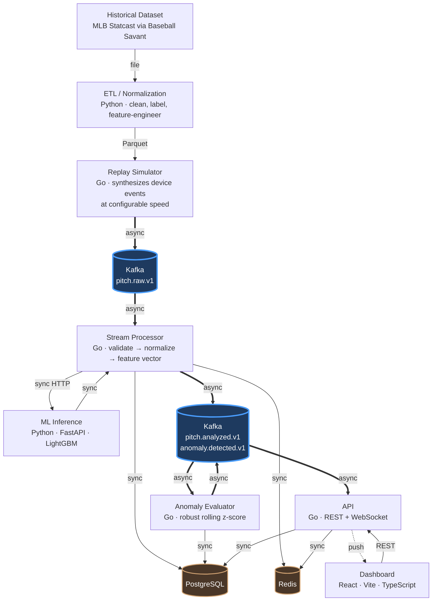

# PitchLab

**An event-driven pitch analytics platform that replays historical MLB Statcast data as a live tracking-device feed, scores every pitch with a calibrated ML model, and streams the results to a real-time dashboard.**

[](#roadmap)
[](https://go.dev)
[](https://python.org)
[](https://react.dev)

> **The goal is not to build the largest possible system.** It is to build a coherent, technically defensible, production-minded platform where every architectural decision — including the ones that were *rejected* — has a written justification.

---

## What problem does this solve?

A pitching coach watching a bullpen session wants to know three things, in real time:

1. **Was that a good pitch?** — not "was it 96 mph", but "given its velocity, spin, movement, release point and the count, how likely was it to produce a swing-and-miss?"
2. **How does it compare?** — to the league, and to this pitcher's own arsenal.
3. **Is something wrong?** — is the release point drifting, is velocity down, is this an early sign of fatigue?

Real tracking hardware (Hawk-Eye, TrackMan) is not available outside a stadium. So PitchLab **replays historical Statcast records as if they were arriving from a live device**, pushing them through a genuine event pipeline — Kafka → stream processor → ML inference → persistence → WebSocket → dashboard.

This makes it possible to build and demonstrate a real-time system without real-time hardware, while exercising every part of the production path.

---

## Architecture



**Thick blue arrows are asynchronous** (Kafka). Everything else is synchronous request/response, except the dashed WebSocket push.

The rule: a hop is synchronous when someone is *waiting for the answer*. The processor cannot persist a pitch without its prediction — so that call is synchronous. Nobody waits for the anomaly evaluator — so that hop is asynchronous.

---

## The ML problem

### It is not a made-up "pitch quality" score

The tempting approach is to invent a label — `0.4 × velocity + 0.3 × spin + 0.3 × movement` — and train a model on it. That is a tautology: the model just relearns the formula, and the weights are indefensible.

Instead, PitchLab predicts **something that actually happened**.

### Primary target: 5-class pitch outcome

For every competitive pitch, predict a calibrated probability distribution over:

| Class | Source |
|---|---|
| `BALL` | `description ∈ {ball, blocked_ball}` |
| `CALLED_STRIKE` | `description = called_strike` |
| `SWINGING_STRIKE` | `description ∈ {swinging_strike, swinging_strike_blocked}` |
| `FOUL` | `description ∈ {foul, foul_tip}` |
| `IN_PLAY` | `description = hit_into_play` |

This was chosen over four alternatives — whiff probability (covers only ~47% of pitches), called-strike probability (~53%, and being eroded by the 2026 ABS system), expected wOBA (**double leakage**: the target is derived from exit velocity and launch angle, *and* its mere presence reveals that contact occurred), and run-value regression (a spiky, discontinuous target dominated by base/out state rather than by the pitch).

The 5-class formulation covers **100% of pitches** and contains the other two targets as marginals.

### The presentation score is derived, not invented

```
xRV        = Σ  P(class) × RV[class, count_state]
PitchScore = 100 + 10 × ((μ − xRV) / σ)
```

- `RV[class, count]` is a 5×12 table of **empirical league averages** computed from the training split only
- `μ`, `σ` come from the training split and are frozen into the model artifact
- `100 / 10` is the industry convention used by public pitch-quality models (mean 100, SD 10, higher is better)

Every link in the chain comes from data. There is no hand-tuned weight anywhere, and the score is **reversible** — you can walk `PitchScore → xRV → class probabilities → feature contributions` and show your work in the UI.

### Two models, because one target does not answer both questions

The design called for a second "stuff" model: the same 5-class target, trained without location features, so that `stuff_score` would measure the pitch itself and `pitch_score − stuff_score` would isolate location's contribution.

Measurement killed that. Physical features reach only **0.554 AUC on the swing decision** — barely better than a coin flip. That is obvious in hindsight: a batter decides whether to offer based on where the pitch is going, not on its spin rate. Since the swing/take split dominates the 5-class target, a location-free model of it is close to useless (+1.3% over baseline).

Conditioning on a swing changes the picture — the same features reach **0.652 AUC**. So the stuff model was re-pointed at the question public Stuff+ models actually ask:

| Model | Target | Features | Answers |
|---|---|---|---|
| `pitching` | 5-class outcome, every pitch | physical + context + location | How good was this pitch, all in? |
| `stuff` | P(whiff \| swing), swings only | physical only | How hard is this pitch to hit when offered at? |

`location_score` was dropped for v1. The two models now predict different targets on different populations, so their scores are not on a common scale and subtracting them would manufacture a meaningless number. Location's contribution is still reported — `dist_from_zone_center` alone carries 58% of the outcome model's split gain — but turning that into a published score needs an ablation-based approach, deferred to the hardening phase.

---

## Leakage discipline

This dataset is unusually easy to leak, which is exactly why it is a good exercise. The defense is a **whitelist, not a blacklist**: a field does not enter the model unless it appears in a single `FEATURE_COLUMNS` constant, enforced by a unit test.

Two leaks are worth calling out because they are the ones that get missed:

**1. The missingness pattern.** `launch_speed` is only populated when the ball was hit. Handing the model that column — even full of nulls — hands it the label directly. Gradient boosters use missingness as a split criterion and will separate those classes perfectly. The model looks spectacular and is worthless.

Measured on a 28k-pitch sample, the column's fill rate by outcome class is:

| Class | `launch_speed` populated |
|---|---:|
| `IN_PLAY` | 99.6% |
| `FOUL` | 81.4% |
| `SWINGING_STRIKE` | 0.0% |
| `CALLED_STRIKE` | 0.0% |
| `BALL` | 0.0% |

The leak is wider than "it reveals `IN_PLAY`" — the field answers *did the bat touch the ball*, separating two classes from the other three.

**2. Future information.** `pitcher_days_since_prev_game` is safe. `pitcher_days_until_next_game` is not — that value cannot exist at pitch time, and a large one implies the pitcher got injured. One word apart; scientific validity apart.

One subtle distinction is preserved: `delta_run_exp` is **banned as a feature** (it is a function of the outcome by definition), but its **average per (class × count)** is a league constant — a lookup table, like a wOBA coefficient — and is used to convert probabilities into runs.

**Validation splits are temporal, never random.** Consecutive pitches within a plate appearance are dependent, and arsenal-relative features are pitcher-season aggregates; a random split leaks both.

```
├── train ─────────────┬── validation ──┬── test ────────┬── out-of-regime ──┤
│  2023 + 2024         │  2025 H1       │  2025 H2       │  2026             │
│  ~1.4M pitches       │  ~350K         │  ~350K         │  excluded         │
│  weights, RV table,  │  early stop,   │  read ONCE,    │  drift            │
│  μ/σ, arsenal refs   │  calibration   │  final report  │  demonstration    │
```

A sanity check is baked into the acceptance criteria: if any class reaches OvR AUC > 0.95, that is **an alarm, not a success**.

It fired. `BALL` came in at 0.950 and the outcome model beat its baseline by 33%, far outside the 8–15% band the design predicted. The investigation is in the results below; the short version is that the band was mis-specified, not the model.

## Results

Trained on the 2023–2025 snapshot (2.86M rows pulled, 1.42M after labelling and regime filtering). Test split read once, after the models were frozen.

| Model | Metric | Value | Baseline | |
|---|---|---:|---:|---|
| `pitching` | log loss | **0.9725** | 1.4578 | **+33.3%** |
| `pitching` | ECE | **0.0042** | — | well calibrated |
| `pitching` | accuracy | 58.95% | 36.47% | |
| `stuff` | ROC-AUC | **0.6532** | 0.5000 | |
| `stuff` | log loss | **0.5180** | 0.5442 | **+4.8%** |

Validation and test agree to within 0.05 percentage points (+33.34% vs +33.29%), which is the main evidence that the model is not overfit.

### Was the alarm leakage?

No — it was geometry, and three checks separate the two:

1. **Only geometric classes are affected.** `BALL` reaches 0.950; `CALLED_STRIKE` 0.897. Both are outcomes of pitches the batter *did not swing at*, where the result is by definition the pitch's position relative to the zone. The classes that require contact stay hard: `SWINGING_STRIKE` 0.766, `FOUL` 0.779, `IN_PLAY` 0.814. Leakage does not politely confine itself to three of five classes.
2. **The signal disappears without location.** Physical features alone reach 0.554 on the swing decision. A leaked outcome would show up there too.
3. **The dominant feature is a distance.** `dist_from_zone_center` carries 58% of split gain. That is a property of the ball's own trajectory, measured before the batter's decision resolves — not a property of what happened next.

The design's mistake was setting one expectation band for a target whose difficulty is wildly uneven across classes. The corrected framing: high discrimination on take outcomes is expected; on contact outcomes it would be suspicious.

---

## Why the training window is 2023–2025

Statcast column names are stable. Their **meanings are not.** Four regime breaks matter:

| Year | What changed | Consequence |
|---|---|---|
| **2020** | TrackMan radar → Hawk-Eye optical | Spin axis went from *inferred* to *directly measured* |
| **2021** (Jun 21) | Foreign-substance enforcement | League 4-seam spin dropped ~2318 → ~2231 RPM |
| **2023** | Pitch clock, shift ban, larger bases | Game-level behavior shifted |
| **2026** | **ABS challenge system** | `plate_x` / `plate_z` moved from **front-of-plate to middle-of-plate**; `sz_top` / `sz_bot` became ABS-defined (53.5% / 27% of player height) instead of operator-marked; the zone shrank |

The 2026 break is the dangerous one: **the column names did not change.** A model trained on 2025 and applied to 2026 raises no exception and throws no error — it just becomes quietly wrong.

This was asserted from MLB's field documentation during design, then verified against data. Comparing matched late-June weeks (28k pitches in 2025, 26k in 2026):

| Field | 2025 SD | 2026 SD | Cohen's *d* | |
|---|---:|---:|---:|---|
| `sz_top` | 0.192 | 0.101 | **−1.485** | regime-sensitive |
| `sz_bot` | 0.112 | 0.051 | +0.215 | regime-sensitive |
| `release_speed` | — | — | +0.037 | control |
| `release_spin_rate` | — | — | −0.039 | control |
| `release_extension` | — | — | +0.047 | control |
| `pfx_z` | — | — | −0.019 | control |

The clearest fingerprint is not the mean shift but the **cardinality collapse**: `sz_top` has **13,660 distinct values in 2025 and 243 in 2026**. Under the old system an operator marked the zone by hand on every pitch; under ABS it is derived deterministically from player height, so it collapses to roughly one value per player. Control fields move by |*d*| ≤ 0.05 across the same window, which rules out a generic season-to-season drift.

2026 is therefore excluded from training and evaluation — and repurposed as the **drift demonstration**.

Replaying 2026 against the 2023–2025 model and watching `ml_predicted_class_total` and `ml_feature_null_ratio` shift in Grafana is the concrete answer to "how would you notice your model degrading in production?" — and it is only possible because the data source is live rather than a frozen file.

---

## Secondary capability: performance anomaly detection

Per session, per pitch type, track the pitcher's own physical baseline — release speed, spin rate, release position, extension, movement — using a **robust rolling z-score**:

```
σ̂ = 1.4826 × MAD(window)
z  = (observed − median(window)) / σ̂          window = last 10 outings
```

Median and MAD are used instead of mean and standard deviation because a single injury outing would otherwise inflate the window's `σ` and mask every subsequent real anomaly.

Isolation Forest was evaluated and rejected: it is not explainable (the consumer of this output is a coach, not a data scientist), it needs per-pitcher training data so it cold-starts badly, and its `contamination` parameter is exactly the kind of arbitrary hand-tuned constant this project avoids elsewhere.

Output is directly actionable: *"Fastball velocity is 1.8 mph below the median of your last 10 outings (robust z = −3.4)."*

---

## Engineering decisions worth defending

<details>
<summary><strong>Three long-lived processes, not eight microservices</strong></summary>

`cmd/api` and `cmd/processor` are **two binaries from one Go codebase** — a modular monolith. They share the domain model, repository layer and validation rules; splitting the code would mean keeping two copies of the same `Pitch` struct in sync for no benefit.

They are split at *runtime* because their scaling profiles genuinely differ: the API is latency-bound and driven by unpredictable user traffic; the processor is throughput-bound and driven by Kafka lag. When a 50× replay saturates the processor, the WebSocket hub must not slow down with it.

`pitchlab-ml` **is** a separate service, and passes the test the others fail: different runtime (LightGBM + SHAP is a Python ecosystem), different release cadence (models retrain weekly, backends ship monthly), different scaling shape (stateless CPU-bound inference). It holds no database connection.

Rejected as artificial: separate Athlete / Session / Pitch services (same transactional boundary), an Analytics service (a second process against the same PostgreSQL is an HTTP proxy, not a microservice — analytics lives in `internal/analytics`), an event-routing service, and an API gateway with nothing behind it.
</details>

<details>
<summary><strong>Three Kafka topics, not five</strong></summary>

`pitch.raw.v1` → `pitch.analyzed.v1` → `anomaly.detected.v1`, plus two DLQs.

`pitch.normalized` was rejected because **it has no independent consumer** — the only thing that would read it is the prediction step, in the same process, in the same processing step. Splitting a self-continuing pipeline stage into a topic buys distributed-systems complexity for nothing: an extra serialization, an extra broker round-trip, an extra DLQ, an extra lag metric.

`prediction.generated` was rejected because a prediction is a *property* of a pitch, not a separate event. Splitting it would force consumers into a distributed join and make the dashboard render twice.

The rule: **an event earns a topic when it has at least one independent consumer.**
</details>

<details>
<summary><strong>At-least-once delivery with an idempotent consumer</strong></summary>

Kafka does not deliver exactly once to external systems. The correct answer is to make the consumer idempotent rather than to ask the broker for stronger promises.

```
external_pitch_uid = "<game>:<at_bat>:<pitch>"      -- deterministic natural key
UNIQUE (external_pitch_uid)                          -- enforced in PostgreSQL
INSERT ... ON CONFLICT (external_pitch_uid) DO NOTHING RETURNING id
```

An application-level `SELECT`-then-`INSERT` is open to a race between two processor instances. The database constraint is atomic regardless of concurrency — correctness is enforced at the lowest layer that can enforce it.

Offsets are committed **after** the work completes. The alternative would be at-most-once, which loses pitches.
</details>

<details>
<summary><strong>In-consumer retry, accepting head-of-line blocking</strong></summary>

Retries happen in-process with exponential backoff and jitter (5 attempts, ~3.1s ceiling). Retry topics were rejected because they **break ordering** — pitch 2 lands in a delay topic while pitch 3 flows through normally, and within-session order is a hard requirement.

Permanent errors (schema, validation) are never retried. Retrying malformed JSON five times fails five times and blocks the partition five times longer; a schema error does not heal with time. Those go straight to the DLQ.

The accepted cost — up to ~3.1s of partition delay in the worst case — is visible in `kafka_consumer_lag`.
</details>

<details>
<summary><strong>Redis is genuinely optional</strong></summary>

Three uses were accepted: live session counters (per-pitch writes would cause row-lock contention and MVCC bloat in PostgreSQL — `HINCRBY` is built for this), athlete analytics caching (with the schema version *in the key*, so a deploy invalidates stale entries automatically), and WebSocket fan-out via Pub/Sub (Kafka consumer groups are work-sharing, not broadcast).

Five were rejected, including caching individual pitch rows — a primary-key lookup takes under a millisecond and PostgreSQL already buffers it; adding Redis there buys a network hop and nothing else.

Every Redis call has a **50ms timeout** and falls back to PostgreSQL on any error. `/readyz` reports Redis as `degraded` but still returns `200`. The phase gate is explicit: **`docker compose stop redis` must leave every endpoint working.**
</details>

<details>
<summary><strong>The replay simulator cannot write to the database</strong></summary>

Enforced at compile time — `cmd/replay` does not import the PostgreSQL or Redis drivers.

A real Hawk-Eye camera does not write to your database; it emits events. If the simulator wrote directly, the Kafka → processor → ML → PostgreSQL backbone would never execute during a demo, and normalization plus idempotency logic would exist in two copies that inevitably diverge.

There is a second benefit: because a device cannot know the outcome of a pitch, the simulator cannot emit `launch_speed` or `delta_run_exp` either. **Faithfully imitating the device structurally reinforces the leakage defense.** Ground truth travels in a separate envelope section and is written only to `pitches.actual_outcome`, never into a feature vector.
</details>

<details>
<summary><strong>A lock-free WebSocket hub with typed backpressure</strong></summary>

One hub goroutine owns the client registry — no mutex, so no lock-ordering bug is possible. Each connection gets a reader and a writer goroutine, because the WebSocket protocol permits exactly one of each.

Each client has a **bounded** 256-message channel. Unbounded buffering means ten slow clients can exhaust server memory; bounded buffering means the system degrades predictably. The drop policy is per message type:

| Type | Policy | Why |
|---|---|---|
| `session.metrics` | drop oldest | Cumulative — the stale value is worthless |
| `pitch.analyzed` | drop newest + count | Independent events; the client detects the `seq` gap and backfills over REST |
| `anomaly.detected` | never dropped | Low volume, high value |

The hub writes non-blocking, so one slow client never stalls the broadcast.
</details>

---

## Observability

Every pitch carries a single `correlation_id` (UUIDv7) from the simulator, through the Kafka envelope, into the HTTP call to the ML service, back into the downstream event, and out to the browser console.

```
grep '"correlation_id":"01JX7K..."' → the complete journey of one pitch across every service
```

Instrumentation covers HTTP latency and request counts, Kafka consumer lag and processing rate, DLQ counters, ML inference latency, WebSocket connections and **dropped messages** (the backpressure signal), cache hit/miss, and — for drift detection — predicted-class distribution and per-feature null ratios.

`/healthz` deliberately checks **nothing**. If liveness probed the database, a brief PostgreSQL slowdown would mark every instance unhealthy, trigger a simultaneous restart, and turn a blip into an outage. `/readyz` does the dependency checking.

Distributed tracing is *not* included in v1. At three processes on one machine, correlation IDs plus structured logs plus histograms are sufficient, and an OpenTelemetry collector is one more component to configure and break. It gets reconsidered in the hardening phase, with measurements.

---

## Tech stack

| Layer | Choice | Why |
|---|---|---|
| Backend | Go 1.25 | High concurrency (Kafka consumers + WebSocket hub), single-binary deploys, low memory |
| ML | Python 3.14 · LightGBM · FastAPI | Best-in-class on tabular data; SHAP for explainability; low-latency serving |
| Messaging | Apache Kafka (KRaft) | Ordering per partition, offset-based replay, consumer groups, durability |
| Database | PostgreSQL 16 | Strong constraints, JSONB, partial indexes, `sqlc` for compile-time-safe SQL |
| Cache | Redis 7 | Ephemeral live state and expensive-aggregation caching — never the system of record |
| Frontend | React 18 · Vite · TypeScript | Fast dev loop; TanStack Query for server state, `useReducer` for the stream |
| Observability | Prometheus · Grafana · `log/slog` | Self-hosted, standard, one `compose up` |
| Orchestration | Docker Compose | Kubernetes is operational overhead at this size |

**Deliberately not used:** Kubernetes, gRPC (one synchronous service-to-service hop; HTTP/JSON is easier to debug), an ORM (analytics-heavy workload needs SQL control and no hidden N+1), a schema registry (topic-name versioning plus contract tests, reconsidered when measured), TimescaleDB (native range partitioning suffices).

---

## Data source and licensing

Pitch-level data comes from **MLB Statcast** via **Baseball Savant**, accessed programmatically with [`pybaseball`](https://github.com/jldbc/pybaseball) (MIT).

The MIT license covers the *library*, not the data. MLB's terms permit individual, non-commercial, non-bulk use. This project respects that:

- **Raw data is never committed to this repository** (`data/` is gitignored)
- A narrow, justified window is pulled — three regular seasons, not the full Statcast archive
- Download caching is enabled, and requests are chunked rather than issued as one bulk pull
- Only derived, aggregated artifacts (model files, run-value tables, league constants) may be stored
- Any public demo uses synthetic or anonymized data

Player identity mapping uses the Chadwick Bureau / Lahman register (CC BY-SA 3.0), which is cleanly licensed and may be committed.

---

## Roadmap

| Phase | Scope | Status |
|---|---|---|
| 0 | Discovery & design | ✅ Complete |
| 1 | Data engineering & ML prototype | ✅ Complete |
| 2 | Domain model & PostgreSQL | 🔨 In progress |
| 3 | Go backend · REST | |
| 4 | ML inference service | |
| 5 | Kafka event architecture | |
| 6 | Replay simulator | |
| 7 | WebSocket | |
| 8 | Redis | |
| 9 | React dashboard | |
| 10 | Observability | |
| 11 | Hardening · chaos, load, security | |
| 12 | Demo & documentation | |

Each phase produces something demonstrable on its own — no phase leaves an intermediate artifact that "only makes sense next time."

Three tests are non-negotiable and will not be cut under time pressure: the **leakage tests** in phase 1, the **idempotency and ordering tests** in phase 5, and the **Redis-down test** in phase 8. They are what the project's defensibility rests on.

---

## Getting started

The full stack lands over phases 2–12. What runs today is the ML pipeline.

```bash
git clone <repo-url> && cd pitchlab

# macOS: LightGBM needs the OpenMP runtime
brew install libomp

python3 -m venv .venv
.venv/bin/pip install -r ml/requirements.txt

# Pull two matched sample weeks and verify the data contracts
.venv/bin/python ml/scripts/validate_data.py
```

`validate_data.py` fetches ~54k pitches, checks the label mapping for
unmapped values, reports per-field missingness, and runs the 2025-vs-2026
regime comparison described above. It caches its samples under `data/`, so
reruns are free.

```bash
# Contract tests: label mapping, leakage whitelist, transforms, splits
cd ml && ../.venv/bin/python -m pytest

# Pull the full training window and train (takes ~20 min end to end)
.venv/bin/python ml/scripts/pull_seasons.py --seasons 2022 2023 2024 2025 --label full
.venv/bin/python ml/scripts/train_model.py --version pitch-outcome-v1.0.0
```

The test split refuses to load without `PITCHLAB_ALLOW_TEST_SET=1`. The friction
is deliberate: looking at the test score and then changing the model turns it
into a validation set and invalidates the number reported.

```bash
make demo          # compose up → migrate → seed → replay   (target: phase 12)
```

**Prerequisites:** Go 1.25+, Python 3.12+, Node 20+, Docker with Compose v2.

> `pandas` is pinned below 3.0: `pybaseball` declares an unbounded
> `pandas>=1.0.3` but predates the 3.0 API changes, so an unpinned install
> resolves to a version it was never tested against.

---

## Success criteria

The project is finished when all of the following are true:

- [ ] `docker compose up` brings the whole stack online in one command
- [ ] Running the replay simulator makes pitches stream **live** into the dashboard over WebSocket
- [ ] Every pitch shows a model prediction and a derived score, with the derivation documented
- [x] The model is trained on leakage-free features and beats a baseline on a **temporal** test set
- [ ] Publishing the same event twice does not create a second database row
- [ ] A poison message lands in the DLQ without stalling the consumer
- [ ] Stopping Redis degrades performance without failing a single request
- [ ] Grafana shows HTTP latency, Kafka throughput, and ML inference latency
- [ ] One `correlation_id` traces a single pitch end-to-end across every service log

---

## License

MIT for the source code. Data is subject to the terms of its respective providers — see [Data source and licensing](#data-source-and-licensing).
